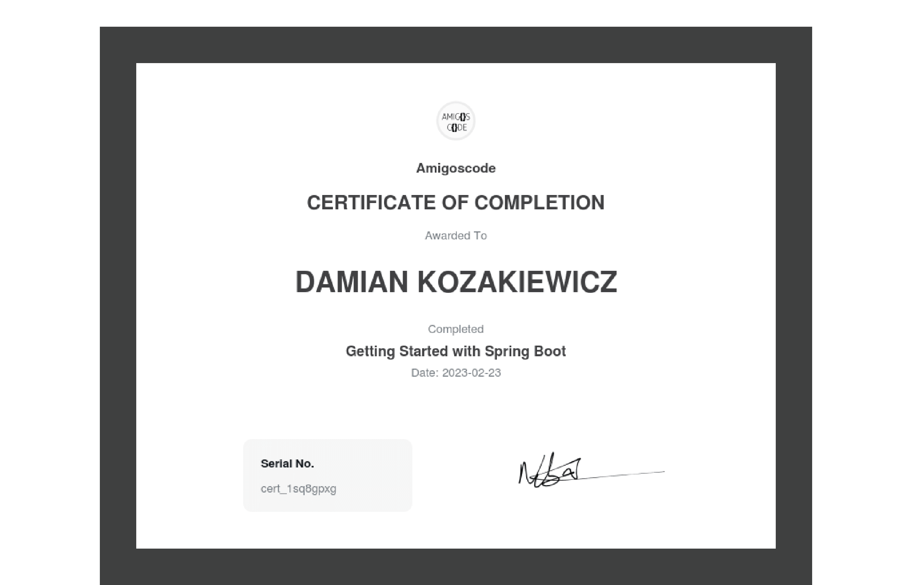

# spring_boot_tutorial

A basic Spring Boot Api which performs crud operations on a Customer Table in Postgres.

## Requirements

- Java / Spring Boot /JPA
- Docker (Postgresql)

---

## Learned Spring Boot through a starter class

